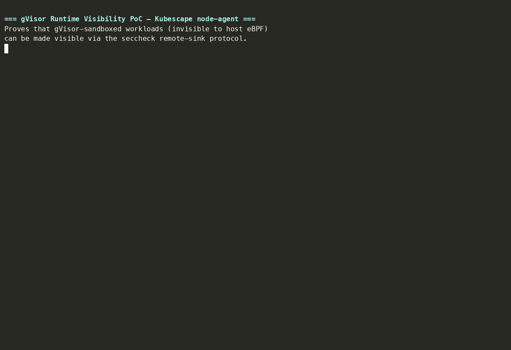

# gVisor runtime visibility for Kubescape node-agent — working PoC

**Part B of [kubescape/kubescape#2557](https://github.com/kubescape/kubescape/issues/2557): a working proof-of-concept for one signal source, fed into the node-agent event shape.**

The node-agent sees process/network/file activity by attaching eBPF probes to the **host** kernel. A workload running under **gVisor** never issues host syscalls — its syscalls are serviced by the **Sentry** in userspace — so from the host kernel's point of view a gVisor-sandboxed agent actor is a black box. That is the visibility gap the issue calls out: *"gVisor-isolated actors currently remain opaque to kernel-level eBPF monitoring."*

This PoC closes it for one signal source. It runs a **monitoring process** that speaks gVisor's `seccheck` **remote sink** protocol, decodes the real Sentry trace-point stream, and **normalizes each point into the exact event shape node-agent already consumes** (`exec`, `network`, `open`, `fork`, `exit`, `ptrace`, …). The Sentry sees everything the sandboxed actor does; this is the adapter that gets those signals into Kubescape's existing detection pipeline.

---

## Demo

> Cluster-free E2E (replayer) followed by live events from a real `--runtime=runsc` container on EC2 (Amazon Linux 2023, Go 1.25, runsc release-20260810.0):



---

## Two ways to run

This PoC supports **two independent run modes** — both exercise the same collector code path. The only difference is who sends the seccheck point stream.

### Mode 1: Cluster-free E2E (no Docker, no runsc, no cluster)

A faithful **replayer** (`cmd/fakesentry`) drives a realistic agent-sandbox session over the **real wire protocol** (handshake + 8-byte header + gVisor protobufs). This is the fastest way to verify the decode + normalize pipeline works. Runs on any machine with Go installed.

```bash
make e2e     # build, run collector + fakesentry, assert
make test    # unit tests over decode + normalization
```

**Verified output** ([full output](evidence/e2e-output.txt)):

```
==> replaying agent-sandbox session with fakesentry
fakesentry: connected, server version=1
fakesentry: sent 8 points, closing.

==> collector stderr:
    collector: handshake ok (peer version=1)
    collector: client disconnected. points=8 mapped=7 unmapped=1 dropped(reported by sender)=0

PASS: 8/8 points decoded from the real seccheck wire format and normalized to node-agent events.
```

The replayed session models a malicious agent actor: it spawns a shell, curls an external payload, reads `/etc/shadow`, attempts `ptrace`, and exits — all inside a gVisor sandbox. Every event is decoded from the real protobuf schemas and mapped to a node-agent event type.

Sample normalized event (a `connect()` from inside the sandbox — invisible to host eBPF):

```json
{
  "source": "gvisor/seccheck",
  "seccheck_message": "MESSAGE_SYSCALL_CONNECT",
  "node_agent_event_type": "network",
  "node_agent_mapped": true,
  "container_id": "agent-sandbox-actor-7f3a2b19",
  "pid": 42,
  "process_name": "curl",
  "details": { "fd": 3, "remote": "203.0.113.7:80" }
}
```

### Mode 2: Real gVisor (Docker + runsc, no cluster)

A **real Sentry** sends live trace points from an actual `--runtime=runsc` container. The collector attaches to the **already-running** sandbox via `runsc trace create` (no restart needed) — this is the dynamic-attach capability the design relies on for production.

```bash
# install runsc: https://gvisor.dev/docs/user_guide/install/
./scripts/run-with-runsc.sh
```

**Verified output from EC2** ([full output](evidence/live-gvisor-output.txt)) — **142 live events captured in 15 seconds**:

```
==> launching gVisor-sandboxed workload
    container: 6abb3412129b
==> attaching seccheck trace session
    collector: handshake ok (peer version=1)
    Trace session "Default" created.
```

Live `exec` — every binary execution inside the sandbox, with full argv:
```json
{
  "seccheck_message": "MESSAGE_SYSCALL_EXECVE",
  "node_agent_event_type": "exec",
  "node_agent_mapped": true,
  "details": {
    "argv": ["wget", "-q", "-O-", "http://example.com"],
    "pathname": "/usr/bin/wget"
  }
}
```

Live `connect` — egress destination attributed to the sandbox container:
```json
{
  "seccheck_message": "MESSAGE_SYSCALL_CONNECT",
  "node_agent_event_type": "network",
  "node_agent_mapped": true,
  "details": {
    "fd": 3,
    "remote": "172.66.147.243:80"
  }
}
```

**Event breakdown** (15-second capture window):

| Event type | Count | What it catches |
|---|---|---|
| `network` | 77 | socket, connect, DNS — egress destinations invisible to host eBPF |
| `exit` | 23 | process lifecycle inside the sandbox |
| `fork` | 21 | child process creation |
| `exec` | 21 | every binary execution with full argv |

---

## What works today

- A **collector** (`cmd/collector`) that binds the `SOCK_SEQPACKET` UDS, performs the seccheck handshake, decodes the protobuf point stream against **gVisor's real schemas**, normalizes it, and emits JSON.
- A **normalizer** (`internal/normalize`) with an explicit, documented seccheck-to-node-agent mapping table.
- A **cluster-free end-to-end test** (`make e2e`): runs on any machine with Go — no Docker, no runsc, no cluster.
- A **real-gVisor path** (`scripts/run-with-runsc.sh`): runs on any Linux box with Docker + runsc — no cluster.
- **Unit tests** over the decode + mapping (`go test ./...`).

The protobuf bindings in `internal/pb` are generated from the **actual gVisor `.proto` files** (vendored under `proto/` with provenance), so the bytes decoded here are the bytes a real Sentry emits.

## Signal-source mapping

| seccheck message | node-agent `EventType` | mapped |
|---|---|---|
| `MESSAGE_SYSCALL_EXECVE`, `MESSAGE_SENTRY_EXEC` | `exec` | yes |
| `MESSAGE_SYSCALL_CONNECT/SOCKET/BIND/ACCEPT/LISTEN` | `network` | yes |
| `MESSAGE_SYSCALL_OPEN` | `open` | yes |
| `MESSAGE_SENTRY_CLONE`, `MESSAGE_SYSCALL_CLONE/FORK` | `fork` | yes |
| `MESSAGE_SENTRY_TASK_EXIT`, `MESSAGE_SENTRY_EXIT_NOTIFY_PARENT` | `exit` | yes |
| `MESSAGE_SYSCALL_PTRACE` | `ptrace` | yes |
| `MESSAGE_SYSCALL_RAW` | `syscall` | yes |
| `MESSAGE_CONTAINER_START` | — (metadata: sandbox/container correlation) | — |

## The `Default`-session constraint (called out honestly)

gVisor currently allows **exactly one** trace session, and it must be named
`Default` (`pkg/sentry/seccheck/config.go`: `only a single "Default" session is
supported`). If the platform or another tool already holds that session,
node-agent cannot attach a second one. This is the single most important
operational constraint for productionizing Part B. The design doc analyzes it and
proposes a contention/fallback strategy (host-boundary signals + a shared-sink
broker). See [`docs/DESIGN.md`](docs/DESIGN.md).

## Layout

```
cmd/collector      monitoring process: UDS server, decode, normalize, emit JSON
cmd/fakesentry     replays a real seccheck point stream (cluster-free E2E sender)
internal/wire      8-byte remote-sink header framing (faithful to gVisor)
internal/pb        protobuf bindings generated from gVisor's real .proto files
internal/normalize seccheck point -> node-agent event mapping (+ tests)
configs/           runsc trace-session.json (points + remote sink)
scripts/           e2e.sh (cluster-free), run-with-runsc.sh (real gVisor)
proto/             vendored gVisor .proto (provenance for internal/pb)
third_party/       pinned protobuf runtime clones for fully-offline builds
evidence/          verified E2E + live-gVisor output, demo recording
application/       LFX 2026 Term 3 application materials
```

## Verified environment

The outputs in `evidence/` were captured on:

```
Amazon Linux 2023 (x86_64), EC2 t3.small, ap-south-1
Go 1.25.12, runsc release-20260810.0 (spec 1.2.1), Docker 25.0.16
```

## Scope and non-goals

This is a **PoC for one signal source**, per the issue's minimum Part B ask. It
proves the pipe end to end and the node-agent event mapping. It is **not** a
production node-agent integration: wiring the collector in as a node-agent
`containerwatcher` tracer, DNS derivation from connect payloads, and the
multi-sandbox sink broker are the natural next steps, sketched in the design doc.

## LFX Mentorship 2026 Term 3 — Application

This repo is part of my application for [kubescape/kubescape#2557](https://github.com/kubescape/kubescape/issues/2557) (CNCF LFX Mentorship, Sep-Nov 2026). All application materials are in [`application/`](application/):

| Document | Description |
|---|---|
| [RFC: Agent-Runtime Security](application/RFC-agent-runtime-security.pdf) ([HTML](application/RFC-agent-runtime-security.html)) | Full design RFC covering posture scanning, admission control, and gVisor runtime visibility for agent-runtime CRDs |
| [Cover Letter](application/cover-letter.pdf) | Why this project, why me, and what I'd bring to the mentorship |
| [Resume](application/resume.pdf) | 6 years building endpoint agents, kernel-level instrumentation, eBPF tracing, and detection pipelines at cybersecurity companies |

**Related PRs:**
- [kubescape/designs-and-proposals#14](https://github.com/kubescape/designs-and-proposals/pull/14) — gVisor runtime visibility design proposal
- [kubescape/regolibrary#789](https://github.com/kubescape/regolibrary/pull/789) — `AgentRuntimeHardening` framework (wires merged C-0297/C-0301 controls)

## Provenance / licensing

`proto/*.proto` are copied from [google/gvisor](https://github.com/google/gvisor)
(`pkg/sentry/seccheck/points/`, Apache-2.0) with import paths flattened.
`internal/wire` reimplements gVisor's remote-sink header (Apache-2.0). The
protobuf runtime under `third_party/` is a pinned upstream clone, kept local so
the PoC builds without a module proxy.
